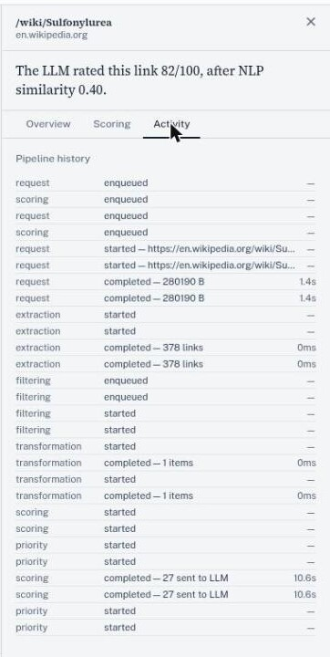
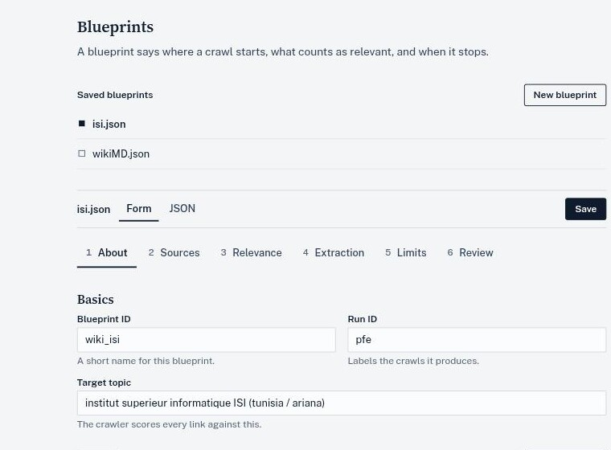

<div align="center">

# CrawlViz

**Crawl only the links worth following.**<br>
A topic-focused web crawler that scores every link before it fetches it, draws the crawl as a live graph, and keeps the reason for every decision so you can replay it.

[](https://github.com/omarbounawarapy/crawlviz/actions/workflows/ci.yml) [](LICENSE) [](pyproject.toml)

[Quick start](#quick-start) · [Tour](#a-tour-of-the-interface) · [Architecture](docs/01-architecture.md) · [Docs](docs/00-index.md) · [Project report](report/rapport-english.pdf)

<br>


<sub>A real crawl of en.wikipedia.org, seeded from "Diabetes" and stopped at 512 pages. Darker discs got further along, vermilion rings mark links judged relevant, and dashed boxes were skipped as off-topic.</sub>

</div>

## What it does

CrawlViz is a topic-focused web crawler. Instead of exploring a site exhaustively, it decides, link by link, in real time, which parts of the web are worth visiting to satisfy a stated topic, and which aren't.

The core problem it solves: a structural crawl (breadth-first from a seed page) has no notion of *meaning*. Starting from "Black Hole" on Wikipedia, a pure BFS drifts into science-fiction and video-game pages within a few hops, because those pages are densely linked to the seed even though they're off-topic. CrawlViz replaces "explore what's linked" with "explore what's relevant," using a cascade of a cheap local embedding model and a selectively invoked LLM to score every candidate link before it's ever fetched.

That scoring decision is one part of a larger system. An asyncio event bus coordinates roughly a dozen independent pipelines (fetching, extraction, deduplication, scoring, priority, transformation, export, retry, logging). A React frontend renders the crawl graph live over WebSocket and can scrub backward through its own event history. A two-tier tracing system lets a crawl's behavior be reconstructed after the fact, not just watched live.

This documentation is organized so you can go as deep as you need and stop there. A recruiter can read this page, an engineer can read the architecture and deep dives, and a reviewer who wants to check a specific claim against the code can follow the file:line references throughout.

## Quick start

```bash
git clone https://github.com/omarbounawarapy/CrawlViz.git
cd CrawlViz
make install                      # uv sync + npm install
cp keys.example.json keys.json    # add a key for the LLM provider you use
make dev                          # API on :8000, UI on :5173
```

Open <http://localhost:5173>. The landing page has a **Load a sample replay** button that plays a synthetic crawl in the browser, so you can explore the interface before running a real crawl. Full setup, providers and tests: [`docs/08-developer-guide.md`](docs/08-developer-guide.md).

<p align="center">
  
</p>

## A tour of the interface

Every page in the graph is a node. The disc says how far it got, the ring says how promising it was, and the number is the LLM's 0 to 100 score. Links the crawler refused to follow can be shown as dashed boxes, so you can check what it threw away, not just what it kept.

### Click any page, get the reason

Selecting a node opens the reasoning for that one link. The **Scoring** tab breaks the local NLP score into its eleven signals (target similarity, contextual consistency, novelty injection, cluster distance and so on) and shows how it combined with the LLM's rating into a final priority. The **Activity** tab lists every pipeline stage that touched the page, with timings.

<table>
  <tr>
    <td width="50%" align="center"></td>
    <td width="50%" align="center"></td>
  </tr>
  <tr>
    <td align="center"><sub><b>Scoring.</b> NLP similarity 0.40, LLM rating 82/100, final priority 0.554.</sub></td>
    <td align="center"><sub><b>Activity.</b> A 280 KB page fetched in 1.4 s, 378 links extracted, 27 sent to the LLM in 10.6 s.</sub></td>
  </tr>
</table>

### Scrub backward through the crawl

The graph is rebuilt from a stream of events, so the timeline under it is a real history. Drag it to any earlier point and the graph and the measurements panel return to that moment. **Return to live** snaps back.

<p align="center">
  
  <br>
  <sub>Replaying event 218 of 814 on the built-in synthetic sample (generated in the browser, not a real crawl).</sub>
</p>

### Tune the cascade

The scoring cascade is the cost lever. Links below the low threshold are mostly skipped, most links above the high threshold are trusted on the local score, and the band in between goes to the LLM. The Config tab shows the live values and what each one does.

<p align="center">
  
</p>

### Describe a crawl as data, read what it kept

A blueprint is a JSON document that says where a crawl starts, what counts as relevant and when it stops. The form editor walks through it in six steps, and the Data tab shows the fields the crawler actually extracted.

<table>
  <tr>
    <td width="50%"></td>
    <td width="50%"></td>
  </tr>
  <tr>
    <td align="center"><sub><b>Blueprints.</b> Form or raw JSON, validated against a Pydantic schema.</sub></td>
    <td align="center"><sub><b>Data.</b> Extracted pages with score, headings, lists and infobox counts.</sub></td>
  </tr>
</table>

## Start here, by what you need

| You want to... | Go to |
|---|---|
| Understand what CrawlViz does and why, in five minutes | You're reading it |
| See the system architecture and how components fit together | [`docs/01-architecture.md`](docs/01-architecture.md) |
| Trace exactly what happens to one discovered link, step by step | [`docs/02-execution-walkthrough.md`](docs/02-execution-walkthrough.md) |
| Understand the event-driven pipeline and its concurrency model | [`docs/03-deep-dive-event-pipeline.md`](docs/03-deep-dive-event-pipeline.md) |
| Understand how semantic scoring and the NLP/LLM cascade work | [`docs/04-deep-dive-semantic-scoring.md`](docs/04-deep-dive-semantic-scoring.md) |
| Understand resilience, observability, and replay | [`docs/05-deep-dive-resilience-observability.md`](docs/05-deep-dive-resilience-observability.md) |
| Read the algorithms formally (scoring, priority, backoff) | [`docs/06-algorithms.md`](docs/06-algorithms.md) |
| See the research protocol and results from the project report | [`docs/07-research-and-evaluation.md`](docs/07-research-and-evaluation.md) |
| Install, run, test, and configure the system | [`docs/08-developer-guide.md`](docs/08-developer-guide.md) |
| See the architectural trade-offs and why they were made | [`docs/09-design-decisions.md`](docs/09-design-decisions.md) |
| See the full navigation map and how these documents relate | [`docs/00-index.md`](docs/00-index.md) |
| Read the full academic project report (design rationale, methodology, evaluation) | [`report/rapport-english.pdf`](report/rapport-english.pdf) |

## What's technically distinctive here

The deep dives explain the mechanism behind each of these, not just the label:

- **A two-stage scoring cascade**, not a single LLM call per link. Every candidate link is first scored by a local sentence-embedding similarity pass (milliseconds, no network call); only a budgeted, strategy-dependent sample of the mid-confidence links is then sent to an LLM. This keeps LLM cost and latency from becoming the crawl's bottleneck. See [`docs/04-deep-dive-semantic-scoring.md`](docs/04-deep-dive-semantic-scoring.md).
- **An in-process pub/sub event bus** (57 distinct typed events across the backend) decouples fetching, extraction, filtering, scoring, priority calculation, transformation, and export into independently scheduled pipelines that never call each other directly. See [`docs/03-deep-dive-event-pipeline.md`](docs/03-deep-dive-event-pipeline.md).
- **A `Future`-based readiness gate on every node** (`Node.ready`) that solves a genuine race condition. It lets the scoring pipeline pick up a node the instant it's created, while still guaranteeing it won't try to score a node whose content hasn't finished being fetched and processed. See [`docs/03-deep-dive-event-pipeline.md`](docs/03-deep-dive-event-pipeline.md#the-node-ready-synchronization-gate).
- **A checkpoint-assisted event-sourced frontend.** The React state is built entirely by replaying a WebSocket event log through a pure reducer. The UI can scrub to any past point in the crawl by seeking to the nearest periodic checkpoint and replaying only the remainder, rather than replaying the whole log on every scrub. See [`docs/05-deep-dive-resilience-observability.md`](docs/05-deep-dive-resilience-observability.md).
- **A declarative blueprint model.** A crawl's seeds, domains, scoring strategy, extraction fields, and stop conditions are all data (a JSON document validated against a Pydantic schema), not code. The crawl engine itself is written once and reused across arbitrarily many topic configurations.

## What CrawlViz is not (yet)

- It is **not distributed**. It's a single-process asyncio application with in-memory state; "concurrency" here means cooperative multitasking within one process, not multiple machines or processes.
- The backend test suite (226 tests, all passing as of this review) covers pipelines, the blueprint schema/translator, and event wiring. It does not include end-to-end or live-LLM integration tests.
- Persistence is local SQLite, not a horizontally scalable store, appropriate for the single-machine research/portfolio scope this project targets, not for production multi-tenant crawling.


## Reference case study

The project report documents a full run against `wikimd.org` (a medical encyclopedia), seeded from "Type 2 Diabetes," with a 1200-second budget and a 600-node cap. It explored 539 nodes out of 50,828 identified links (~1%) and produced a graph that clustered cleanly into complications, treatments, and epidemiology sub-topics, connected by bridge nodes like "Glycemic Index" and "HbA1c." That configuration is checked into this repository as `templates/wikiMD.json` and matches the report's parameters. Full protocol and results: [`docs/07-research-and-evaluation.md`](docs/07-research-and-evaluation.md), sourced from [§4.3 — Practical Evaluation](report/rapport-english.pdf#page=66) of the project report.

## Technology stack

| Layer | Technology | Role |
|---|---|---|
| Crawl engine | Python 3.12 / `asyncio` | Cooperative concurrency for an I/O-bound workload |
| HTTP | `aiohttp` | Non-blocking page fetches |
| HTML parsing | `lxml` | XPath/CSS-driven link and field extraction |
| Semantic scoring | `sentence-transformers` (local) | Cheap, offline embedding similarity |
| Relevance / expansion | LLM via OpenRouter, OpenAI, Anthropic, Gemini, NVIDIA, or Groq (`aiohttp`-based client) | Selective, budgeted relevance judgments and topic expansion |
| Control plane | FastAPI | REST API for templates, run control, config, validation |
| Data plane | `websockets` | Live crawl-state push to the browser |
| Persistence | SQLite (WAL mode) | Extracted-item export |
| Frontend | React + Vite | Live graph visualization, replay, inspection |

Full list with versions: `pyproject.toml` / `crawler-ui/package.json`.
