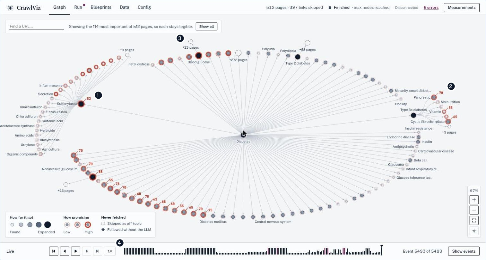
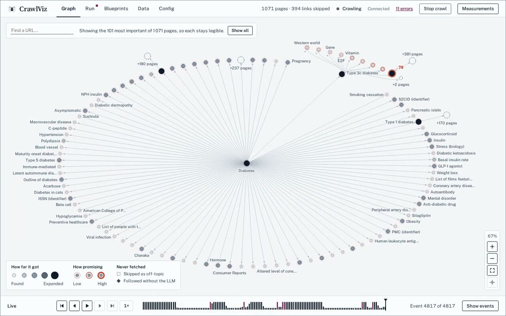
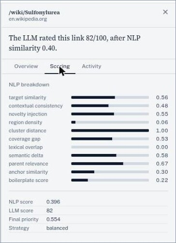
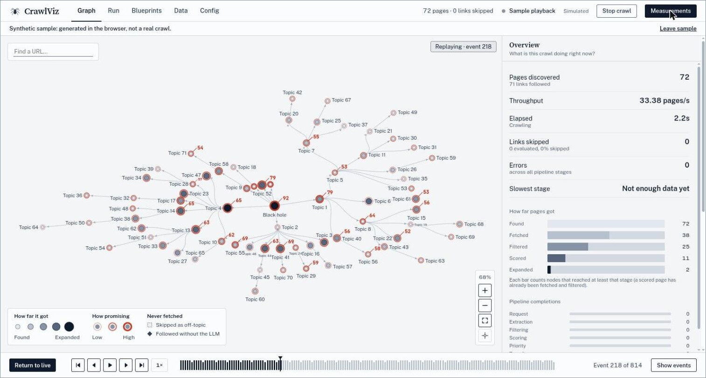
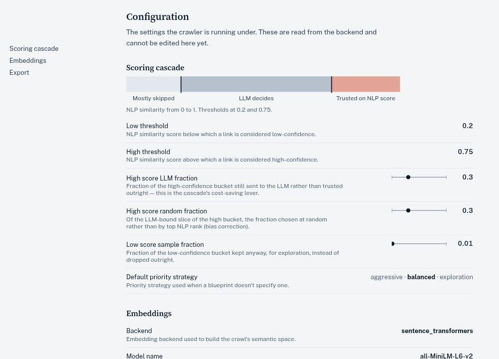
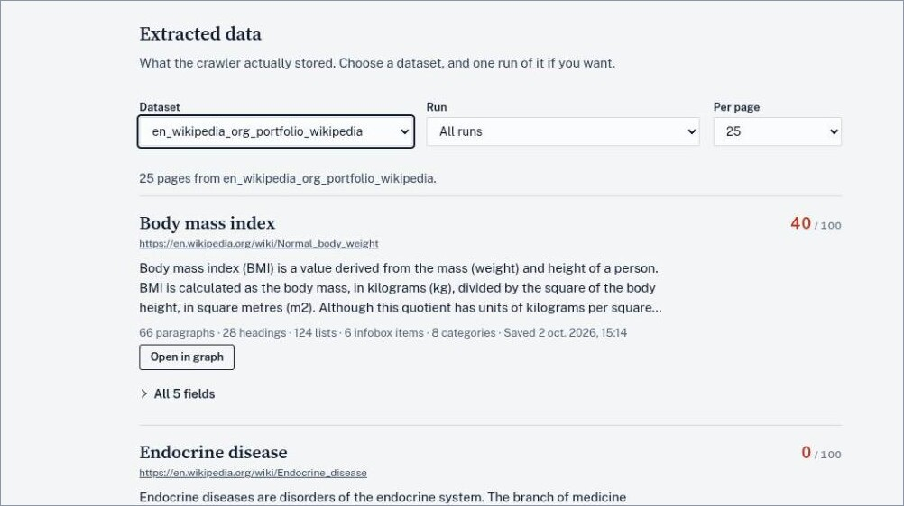

<div align="center">

# CrawlViz

**Crawl only the links worth following.**<br>
A topic-focused web crawler that scores every link before it fetches it, draws the crawl as a live graph, and keeps the reason for every decision so you can replay it.

[](https://github.com/omarbounawarapy/crawlviz/actions/workflows/ci.yml) [](LICENSE) [](pyproject.toml)

[Tour](#a-tour-of-the-interface) · [Run it yourself](#run-it-yourself) · [Docs index](#start-here-by-what-you-need) · [Project report](report/rapport-english.pdf)

<br>



<sub>A real crawl of en.wikipedia.org, seeded from "Diabetes" and stopped at 512 pages.<br>**1** A darker disc: the page was fetched and its links were expanded. **2** A vermilion ring with a number: the link was judged relevant, and the number is the LLM's 0 to 100 score. **3** A dashed box: a group of links skipped as off-topic. **4** The timeline: every event is kept, so the crawl can be replayed.</sub>

</div>

In the reference run on `wikimd.org`, CrawlViz explored **539 nodes out of 50,828 identified links (about 1%)** and still produced a graph that clustered cleanly into complications, treatments and epidemiology. [Details below](#reference-case-study).

## What it does

A structural crawl (breadth-first from a seed page) has no notion of *meaning*. Starting from "Black Hole" on Wikipedia, a pure BFS drifts into science-fiction and video-game pages within a few hops, because those pages are densely linked to the seed even though they're off-topic. CrawlViz replaces "explore what's linked" with "explore what's relevant": a cheap local embedding model and a selectively invoked LLM score every candidate link before it is ever fetched.

Around that decision sits an asyncio event bus coordinating roughly a dozen independent pipelines, a React frontend that renders the crawl live and can scrub through its own history, and a two-tier tracing system that lets a crawl be reconstructed after the fact. The docs go as deep as you want to read and carry file:line references, so a claim can be checked against the code.

## A tour of the interface

### Watch a whole run

One minute, recorded with Playwright against a real crawl of en.wikipedia.org from "Diabetes": pick a blueprint, start, watch the graph grow (the long middle is sped up 10x), open a scored page, then scrub back through the history.

<p align="center">
  <a href="docs/assets/crawlviz-run.mp4"></a>
</p>

### Click any page, get the reason

Selecting a node opens the reasoning for that one link. The **Scoring** tab breaks the local NLP score into eleven signals (target similarity, contextual consistency, novelty injection, cluster distance and so on) and shows how it combined with the LLM's rating into a final priority. The **Activity** tab lists every pipeline stage that touched the page, with timings.

<p align="center">
  
</p>

### Scrub backward through the crawl

The graph is rebuilt from a stream of events, so the timeline under it is a real history. Drag it to any earlier point and the graph and the measurements panel return to that moment. **Return to live** snaps back.

<p align="center">
  
  <br>
  <sub>Replaying event 218 of 814 on the built-in synthetic sample (generated in the browser, not a real crawl).</sub>
</p>

### Tune the cascade

The scoring cascade is the cost lever. Links below the low threshold are mostly skipped, most links above the high threshold are trusted on the local score, and the band in between goes to the LLM. The Config tab shows the live values and what each one does.

<p align="center">
  
</p>

### Describe a crawl as data, read what it kept

A blueprint is a JSON document that says where a crawl starts, what counts as relevant and when it stops. It is validated against a Pydantic schema and edited in the UI as a form or as raw JSON. This is an abridged `templates/wikiMD.json`:

```jsonc
{
  "blueprint_id": "wikimd_diabetes",
  "target_topic": "Type 2 Diabetes",
  "seeds": [
    { "url": "https://www.wikimd.org/wiki/Diabetes", "domain": "https://www.wikimd.org" }
  ],
  "scoring": {
    "strategy": "TOPICAL",
    "params": { "scoring_type": "groq", "model_information": "openai/gpt-oss-120b" }
  },
  "extraction": {
    "mode": "document",
    "fields": {
      "title":    { "selector": "//h1[@id='firstHeading']", "type": "scalar" },
      "headings": { "selector": "//div[...]//*[self::h2 or self::h3]", "type": "list" }
      // ... paragraphs, lists, infobox_items, categories
    }
  },
  "stop_conditions": { "max_nodes": 500, "max_depth": 10 }
}
```

The **Data** tab then shows what the crawler actually stored for each page: its relevance score, a text preview and the extracted fields.

<p align="center">
  
</p>

## Run it yourself

<p align="center">
  
</p>

```bash
git clone https://github.com/omarbounawarapy/CrawlViz.git
cd CrawlViz
make install                      # uv sync + npm install
cp keys.example.json keys.json    # add a key for the LLM provider you use
make dev                          # API on :8000, UI on :5173
```

Open <http://localhost:5173>. The landing page has a **Load a sample replay** button that plays a synthetic crawl in the browser, so you can explore the interface before running a real crawl. Full setup, providers and tests: [`docs/08-developer-guide.md`](docs/08-developer-guide.md).

## Start here, by what you need

| You want to... | Go to |
|---|---|
| Understand what CrawlViz does and why, in five minutes | You're reading it |
| See the system architecture and how components fit together | [`docs/01-architecture.md`](docs/01-architecture.md) |
| Trace exactly what happens to one discovered link, step by step | [`docs/02-execution-walkthrough.md`](docs/02-execution-walkthrough.md) |
| Understand the event-driven pipeline and its concurrency model | [`docs/03-deep-dive-event-pipeline.md`](docs/03-deep-dive-event-pipeline.md) |
| Understand how semantic scoring and the NLP/LLM cascade work | [`docs/04-deep-dive-semantic-scoring.md`](docs/04-deep-dive-semantic-scoring.md) |
| Understand resilience, observability, and replay | [`docs/05-deep-dive-resilience-observability.md`](docs/05-deep-dive-resilience-observability.md) |
| Read the algorithms formally (scoring, priority, backoff) | [`docs/06-algorithms.md`](docs/06-algorithms.md) |
| See the research protocol and results from the project report | [`docs/07-research-and-evaluation.md`](docs/07-research-and-evaluation.md) |
| Install, run, test, and configure the system | [`docs/08-developer-guide.md`](docs/08-developer-guide.md) |
| See the architectural trade-offs and why they were made | [`docs/09-design-decisions.md`](docs/09-design-decisions.md) |
| See the full navigation map and how these documents relate | [`docs/00-index.md`](docs/00-index.md) |
| Read the full academic project report (design rationale, methodology, evaluation) | [`report/rapport-english.pdf`](report/rapport-english.pdf) |

## What's technically distinctive here

The deep dives explain the mechanism behind each of these, not just the label:

- **A two-stage scoring cascade**, not one LLM call per link: a local embedding pass scores everything, and only a budgeted sample of mid-confidence links goes to an LLM. [Tour](#tune-the-cascade) · [`docs/04`](docs/04-deep-dive-semantic-scoring.md)
- **An in-process pub/sub event bus** (57 typed events) keeps fetching, extraction, scoring, priority and export as independent pipelines. [`docs/03`](docs/03-deep-dive-event-pipeline.md)
- **A `Future`-based readiness gate on every node** (`Node.ready`) that fixes a genuine race between scoring and fetching. [`docs/03`](docs/03-deep-dive-event-pipeline.md#the-nodeready-synchronization-gate)
- **A checkpoint-assisted event-sourced frontend**: state is a pure reducer over the event log, so the UI scrubs from the nearest checkpoint. [Tour](#scrub-backward-through-the-crawl) · [`docs/05`](docs/05-deep-dive-resilience-observability.md)
- **A declarative blueprint model.** A crawl's seeds, domains, scoring strategy, extraction fields, and stop conditions are all data (a JSON document validated against a Pydantic schema), not code. The crawl engine itself is written once and reused across arbitrarily many topic configurations.

## What CrawlViz is not (yet)

- It is **not distributed**. It's a single-process asyncio application with in-memory state; "concurrency" here means cooperative multitasking within one process, not multiple machines or processes.
- The backend test suite (about 250 tests) covers pipelines, the blueprint schema/translator, and event wiring. It does not include end-to-end or live-LLM integration tests.
- Persistence is local SQLite, not a horizontally scalable store, appropriate for the single-machine research/portfolio scope this project targets, not for production multi-tenant crawling.


## Reference case study

The project report documents a full run against `wikimd.org` (a medical encyclopedia), seeded from "Type 2 Diabetes," with a 1200-second budget and a 600-node cap. It explored 539 nodes out of 50,828 identified links (~1%) and produced a graph that clustered cleanly into complications, treatments, and epidemiology sub-topics, connected by bridge nodes like "Glycemic Index" and "HbA1c." That configuration is checked into this repository as `templates/wikiMD.json` and matches the report's parameters. Full protocol and results: [`docs/07-research-and-evaluation.md`](docs/07-research-and-evaluation.md), sourced from [§4.3 — Practical Evaluation](report/rapport-english.pdf#page=66) of the project report.

## Technology stack

| Layer | Technology | Role |
|---|---|---|
| Crawl engine | Python 3.12 / `asyncio` | Cooperative concurrency for an I/O-bound workload |
| HTTP | `aiohttp` | Non-blocking page fetches |
| HTML parsing | `lxml` | XPath/CSS-driven link and field extraction |
| Semantic scoring | `sentence-transformers` (local) | Cheap, offline embedding similarity |
| Relevance / expansion | LLM via OpenRouter, OpenAI, Anthropic, Gemini, NVIDIA, or Groq (`aiohttp`-based client) | Selective, budgeted relevance judgments and topic expansion |
| Control plane | FastAPI | REST API for templates, run control, config, validation |
| Data plane | `websockets` | Live crawl-state push to the browser |
| Persistence | SQLite (WAL mode) | Extracted-item export |
| Frontend | React + Vite | Live graph visualization, replay, inspection |

Full list with versions: `pyproject.toml` / `crawler-ui/package.json`.
