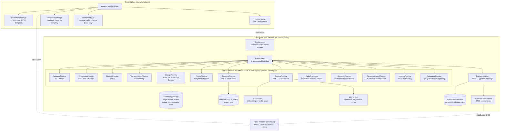

# Architecture

## System overview

CrawlViz is a single Python process (FastAPI + `asyncio`) that, per crawl, spins up around a dozen independently scheduled pipeline objects wired together through one in-process publish/subscribe event bus. A separate React application connects over WebSocket to watch the resulting event stream, and can scrub backward through it via a replay-with-checkpoints reducer.

*Every pipeline, including the UI bridge, is an equal subscriber on the same broker. None of them call each other directly. The only shared contract is the typed event each one publishes or subscribes to.*

**Reading this diagram:** the control plane exists independently of any running crawl. You can list templates or check `/status` with nothing running. The data plane is instantiated fresh per crawl by `core.Crawler` (built in `core/crawler.py`, bootstrapped by `core/boot_strapper.py`). Every pipeline talks to the broker and nothing else. There are no direct pipeline-to-pipeline method calls in the crawl's steady-state operation, which is what "event-driven" concretely means here, not a loose synonym for "asynchronous." The report's system-overview diagram walks through the same broker, plane split, and storage/export separation at the design level: [Chapter 3 — Design, "Global View"](../report/rapport-english.pdf#page=29).

## Component responsibilities

| Component | Owns | Does not do |
|---|---|---|
| `EventBroker` (`core/event_broker.py`) | Routing typed events to subscribed pipelines | Any domain logic. It doesn't know what a `NodeAddedEvent` *means*. |
| `EventRegistry` (`core/event_registry.py`) | The subscription table (event type → list of handlers) | Dispatch. That's the broker's job. |
| `BasePipeline` (`pipelines/base_pipeline.py`) | Generic worker-pool-over-a-queue lifecycle every pipeline inherits | Business logic. Subclasses override `_process()`. |
| `Storage` (`models/storage.py`) | The single in-memory source of truth for nodes, links, domains, and extracted items during a crawl | Persistence. It's gone when the process exits. |
| `ExportingPipeline` | The *only* writer to `items.db` | Anything about the live crawl graph. Export is a one-way, append-only sink. |
| `NLPService` (`services/nlp_service.py`) | A stable read interface (`score_link`, `find_expansion_seeds`) over the embedding engine and vector space | Vector-space mutation. That's `SpaceUpdater`'s job, invoked only through `NLPService`. |
| `LlmHandler` (`infrastructure/llm_handler.py`) | Provider-agnostic orchestration of one LLM request: key selection, translation, retries | Prompt construction or result interpretation. Those live in `models/prompts.py` and `services/results_mapper.py`. |
| `TelemetryBridge` (`ui_bridge/telemetry_bridge.py`) | Translating domain events into the small set of typed UI messages defined in `docs/crawl_messages.ts` | Any transport. It hands finished messages to the gateway and nothing else. |
| `UIWebSocketGateway` (`ui_bridge/ui_websocket_gateway.py`) | Accepting connections, sending catch-up snapshots, broadcasting | Any interpretation of what it's broadcasting. By its own docstring: "no business logic of any kind." |

## The control-plane / data-plane split

`main.py`'s three routers (`templates`, `run`, `validation`) are always live, independent of whether a crawl is executing. The codebase frames this explicitly as CQRS-adjacent: commands (`POST /run`, `POST /stop`) go through `routes/run.py` and mutate the running `Crawler` instance; queries about a *finished* crawl's data go through `routes/validation.py` and read `items.db` directly, never touching the live in-memory `Storage`. The live in-memory graph, meanwhile, is exposed only through the WebSocket data plane (`UIWebSocketGateway`), not through REST. A REST client cannot ask "what does the graph look like right now"; only a WebSocket client, subscribed to the live event stream, can. This control-plane/data-plane split is the same one the report frames as CQRS-adjacent: [Chapter 3 — Design, "Global View"](../report/rapport-english.pdf#page=29).

This separation is why `routes/validation.py` can be a genuinely minimal, read-only, allowlisted SQL layer (`routes/validation_db.py`). Table names are checked against a regex and a blocklist of SQLite internals before ever being interpolated into a query string, every query is `LIMIT`-bounded (max 50 rows), and the connection is opened `mode=ro`. It has no reason to be more than that, because it was never asked to also serve live state.

## Storage: two different things named similarly

The report and the codebase both distinguish two persistence concepts that are easy to conflate ([Chapter 3 — Design, "Global View"](../report/rapport-english.pdf#page=29), on the in-memory storage object versus the export database):

1. **The in-memory `Storage` object** (`models/storage.py`): a set of dicts holding `Node`, `Link`, `Domain`, and extracted-item objects, keyed by ID, with content-hash-based dedup sets for both links and items. This is mutated exclusively by `StoragePipeline` and is the graph the UI is watching live. It does not survive process exit.
2. **`items.db`**: a SQLite database, one table per `(domain, blueprint_id)` pair, written exclusively by `ExportingPipeline` in response to `TransformationCompletedEvent`. This is what `routes/validation.py` reads, and what actually survives a crawl.

A node's *links* live only in-memory (they're needed for graph traversal, not for the export sink); a node's *extracted items* are the only thing that reaches `items.db`. The two pipelines that write each (`StoragePipeline` and `ExportingPipeline`) both subscribe to `TransformationCompletedEvent`. They're two independent consumers of the same signal, not a producer/consumer chain between them.

## Semantic and LLM services, encapsulated

The scoring pipeline never touches an embedding model, a vector index, or an HTTP client directly. It goes through `NLPService` and `LlmHandler`, both of which fully own their internal complexity:

- `NLPService` wraps `EmbeddingEngine` (a `sentence-transformers` model wrapper with an LRU-cached `encode()`), `FeatureExtractor` (turns a `Link` into ~7 named scalar signals), and `VectorSpace` (the semantic basis vectors + `numpy`-backed cosine similarity, with a `DBSCAN`-based coverage/novelty measure; see [`04-deep-dive-semantic-scoring.md`](04-deep-dive-semantic-scoring.md)).
- `LlmHandler` wraps `KeyManager` (cooldown-based multi-key rotation), a per-provider `Translator` (`OpenRouterTranslator`, `OpenAITranslator`, `AnthropicTranslator`, `GeminiTranslator`, or `NvidiaTranslator`, selected by the blueprint's `scoring_type`/`llm_type` string), and `NetworkClient` (the actual `aiohttp` request/retry loop).

Both are constructed once by `BootStrapper` and handed to the pipelines that need them. This is plain dependency injection, not a framework, but it's what makes it possible to unit-test, say, `PriorityPipeline`'s strategy functions (see `tests/test_priority_strategy.py`) without spinning up a real embedding model or a network client.

## Extensibility

Because every pipeline's only coupling to the rest of the system is "subscribe to these event types, emit those event types," adding a new pipeline is additive: register it with the broker (`b.subscribe(new_pipeline, [SomeEvent])`), and nothing about the existing pipelines needs to change. The `TelemetryBridge` itself is evidence this holds in practice. The V2 rework added it, and the roughly dozen crawl pipelines that existed before it required zero changes to accommodate it; it's simply one more subscriber.

## Where to go next

- For a concrete trace of one link's journey through every pipeline above: [`02-execution-walkthrough.md`](02-execution-walkthrough.md).
- For why the event bus exists and how the `Node.ready` synchronization gate resolves a real race condition: [`03-deep-dive-event-pipeline.md`](03-deep-dive-event-pipeline.md).
- For how NLP and LLM scoring actually combine into a priority number: [`04-deep-dive-semantic-scoring.md`](04-deep-dive-semantic-scoring.md).
