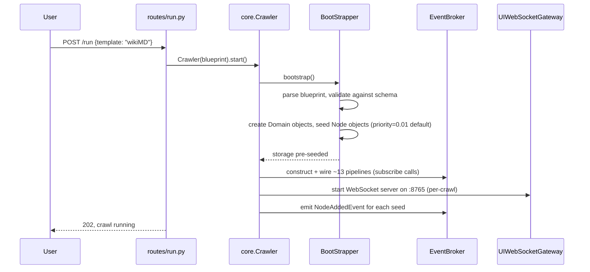
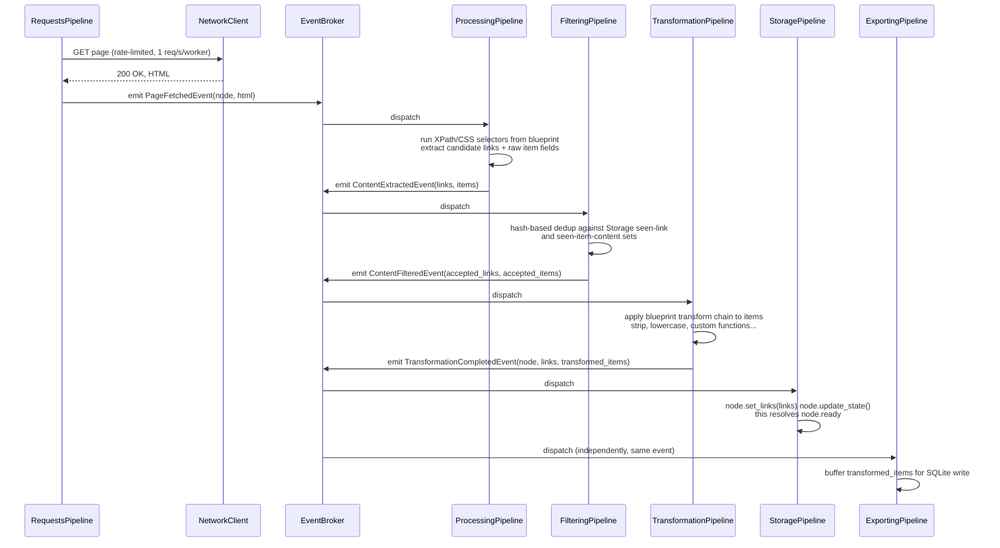
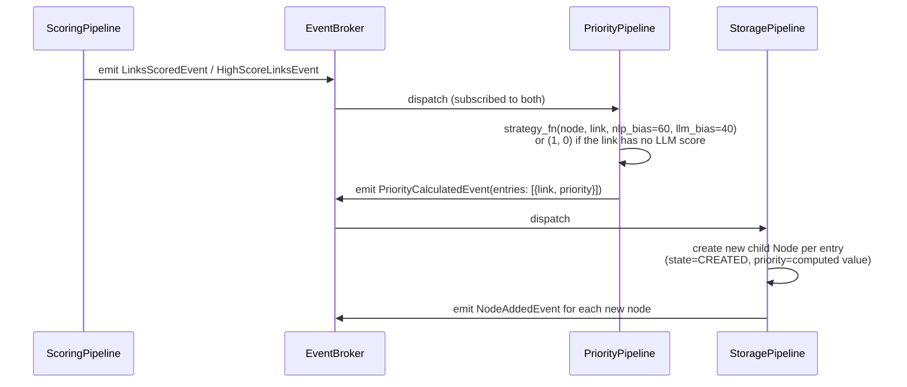

# Execution Walkthrough

This traces one concrete path through CrawlViz: from `POST /run` to a single discovered link becoming a scored, prioritized child node. Every step names the actual class and event type involved, so it can be checked against the source directly.

## 0. Starting a crawl

The control API returns as soon as the crawl task is launched. It does not wait for the crawl to finish. From here on, everything is driven by events; there is no central loop iterating "for each node, do X."

## 1. A seed node enters the frontier

`NodeAddedEvent` for a seed node reaches two independent subscribers at once:

- **`RequestsPipeline`** enqueues it for fetching.
- **`ScoringPipeline`** enqueues it too, but immediately `await`s `node.ready`, a per-node `asyncio.Future` that isn't resolved yet. This is deliberate: the scoring pipeline is allowed to *claim* a node the instant it exists, but it physically cannot start scoring it until the node has content and extracted links. See [§ The `node.ready` synchronization gate](03-deep-dive-event-pipeline.md#the-node-ready-synchronization-gate) for why this matters more than it sounds like it should.

## 2. Fetch, extract, filter, transform

Two things worth being precise about here, because a casual reading of the report's five-state node lifecycle ([§2.7.2 — States in a Node's Lifecycle](../report/rapport-english.pdf#page=19), `CREATED → FETCHED → FILTERED → SCORED → EXPANDED`) would miss them:

- **There's an unlabeled sixth stage.** The `LoggingPipeline` emits a `TRANSFORMED` log line between `FILTERED` and `SCORED` (`pipelines/logging_pipeline.py`), corresponding to `TransformationCompletedEvent`. It isn't one of the report's five named lifecycle states, but it is a distinct, separately logged step in the actual pipeline.
- **The scoring gate is transformation-complete, not filtering-complete.** `node.ready` is resolved by `StoragePipeline._on_transformation_completed`, which fires only after *both* the filtered links are known *and* the item transformation chain has finished. A node whose extracted items are slow to transform (e.g., a long transform chain) delays scoring for that node's links too, even though link scoring conceptually has nothing to do with item transformation. This is a real coupling in the current implementation, not an inference.

## 3. Scoring: the cascade

`ScoringPipeline`'s worker, having been unblocked by `node.ready`, now has a `Node` with a list of candidate `Link` objects. For each link:

1. **NLP pass (always, local, no network):** `NLPService.score_link()` builds a feature vector (target similarity, novelty, coverage, lexical overlap, and other signals; [full list in the deep dive](04-deep-dive-semantic-scoring.md)) and reduces it to a single composite `_nlp_score` used only for bucketing.
2. **Bucketing:** every link in the node is sorted into `low` / `mid` / `high` against two configurable thresholds. `mid` always goes to the LLM. `low` and `high` are each *sampled*: a small random slice from `low` (to avoid the crawl converging on one semantic neighborhood) and a top-K-plus-random slice from `high` (to spend LLM budget confirming the crawler's most confident guesses, not just its uncertain ones). Everything not sampled is either dropped (`low`) or fast-tracked without an LLM call (`high`, tagged `trusted_no_llm`).
3. **LLM pass (selective, budgeted):** the sampled links are batched into one prompt (`ScoringPromptBuilder`, strategy-selected, e.g. `TOPICAL`), sent through `LlmHandler` → `KeyManager` (picks a non-cooling-down API key) → `NetworkClient` (the actual HTTP call, with its own retry/backoff independent of the crawl-level `RetryProcessor`) → `OpenRouterTranslator` (parses the response) → `ResultMapper` (attaches `score`, `relevance_type`, and `expansions` back onto each `Link`).

`ScoringPipeline` emits `LinksScoredEvent` for LLM-scored links and `HighScoreLinksEvent` for the `trusted_no_llm` fast-tracked ones. These are two separate event types precisely because one carries an LLM score and the other doesn't, and `PriorityPipeline` needs to treat them differently (see next step).

## 4. Priority and node creation

This is where the frontier actually grows: each scored link becomes a brand-new `Node`, and `NodeAddedEvent` fires again, which is exactly step 1, recursively. The crawl has no separate "main loop"; it's this event chain running until a stop condition fires.

## 5. Stopping

`StoppingPipeline` subscribes to the node-count and depth signals it needs and evaluates the blueprint's stop conditions (`max_nodes`, `max_depth`, `max_time`) after relevant events. When one is met, it emits `StopCrawlEvent`, which every pipeline treats as a drain-and-halt signal: `ExportingPipeline` flushes its buffer, `RequestsPipeline` stops pulling new fetches, and `Crawler` tears down the WebSocket gateway.

## 6. What the browser sees, the whole time

None of the above waits for a UI client to be connected. `TelemetryBridge` is just one more broker subscriber; if no browser is connected, it still updates `CrawlStateSnapshot` and calls `UIWebSocketGateway.broadcast()`, which is a no-op with zero connected clients. When a client *does* connect (at any point, including mid-crawl), it receives one `SNAPSHOT_FULL` message, the entire current state, node graph and telemetry counters both, and then the same incremental messages every other connected client gets from that point on. See [`05-deep-dive-resilience-observability.md`](05-deep-dive-resilience-observability.md) for how the frontend turns that stream into a scrubbable timeline.
