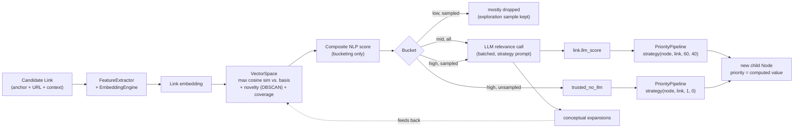

# Deep Dive: Semantic Scoring

## The problem

Scoring every discovered link with an LLM call is the obvious approach and the wrong one at scale. One page can contain dozens of links, each LLM call carries real latency and token cost, and doing this for every candidate would make the LLM the crawl's bottleneck rather than a tool it uses selectively. CrawlViz's answer is a two-stage cascade: a cheap, local, always-on filter, followed by a deliberately budgeted, selective LLM pass.

*Every candidate is scored locally first. Only the ambiguous middle band, plus small exploration/confirmation samples from the low and high bands, ever reaches the LLM. Most candidates never do.*

## Stage 1: representing a link before visiting it

Before any relevance judgment happens, a candidate link has to become something a similarity function can compare. `models/links_extractor.py` pulls three sources out of the HTML around each `<a>` tag:

- the anchor text (what's inside the `<a>` tag),
- the target URL,
- local textual context (text near the link in the parent DOM node).

This multi-source representation exists specifically because any one signal can be uninformative alone. A generic anchor text like "read more" or an empty local context wouldn't tell you much on its own, but combined with the other two sources, `FeatureExtractor` can still produce a useful comparison. `nlp/feature_extractor.py` builds a composite text string from these three sources and encodes it with `EmbeddingEngine` (`sentence-transformers/all-MiniLM-L6-v2`, loaded once and shared, LRU-cached at the `encode()` level so repeated identical strings within a session don't re-run inference).

*Anchor text, URL, and local DOM context are combined into one composite string before a single embedding call, not compared as three separate signals.*

## Stage 2: the semantic basis and the cold-start problem

A link's relevance is computed as a similarity against a set of *basis vectors* representing the target topic, not against a single "topic vector." `nlp/vector_space.py`'s `VectorSpace` holds this set and answers two questions: how similar is a candidate to the *closest* basis vector (`max` cosine similarity, not average; a link only needs to match one facet of the topic well), and how novel or under-covered is a candidate relative to what's already been visited (via a `DBSCAN` clustering pass over visited-content embeddings, so "novelty" means "far from existing clusters," not just "different from the single most recent item").

At the start of a crawl, this basis is thin. Only the seed pages and a short configured topic description exist. The report calls this the cold-start problem explicitly ([§2.1.3 — Multi-Facet Representation of the Topic](../report/rapport-english.pdf#page=11)): with too few basis vectors, the "semantic" similarity score degenerates into something closer to lexical overlap. CrawlViz's answer, also from the report, is LLM-generated **conceptual expansions**. At bootstrap, the LLM is prompted to generate a configurable number of topic-adjacent descriptions (the report's reference run used 50), which are embedded and added to the basis before crawling starts. This is a real, load-bearing use of the LLM that happens *before* any link scoring, not a fallback path.

**The basis keeps growing during the crawl, not just at bootstrap.** `nlp/space_updater.py`'s `SpaceUpdater` subscribes to scoring-adjacent events, buffers incoming signal via `BufferManager`, and periodically (by count threshold or time threshold, whichever comes first) commits new vectors to the space through `NLPService`, never bypassing it, so the vector space always has one write path. This is what the report's [§2.4 — Dynamic Enrichment of the Semantic Basis](../report/rapport-english.pdf#page=13) describes: LLM-produced expansions discovered *during* the crawl (from links the LLM did score) get folded back into the basis, so later-discovered regions of the topic benefit from what was learned scoring earlier ones. `space_store.py` persists this basis to disk, which is also what makes cross-session reuse of a learned semantic basis possible.

## Stage 3: the composite NLP score and bucketing

`NLPService._composite_score()` combines several scalar signals, target similarity (dominant weight), coverage of under-explored regions, novelty versus visited content, contextual coherence with the parent page, and lexical keyword overlap, into a single number per link, `link._nlp_score`. This single score exists for one purpose: **deciding which bucket a link falls into**, not ranking the frontier (that's a separate, later computation, see below).

`ScoringPipeline.bucket_links()` sorts every link in a node against two configurable thresholds (`LOW`, `HIGH`):

| Bucket | Condition | What happens to it |
|---|---|---|
| `low` | score < `LOW` | Mostly dropped. A small random sample is kept anyway, specifically to avoid the crawl converging on a local optimum by only ever reinforcing what it already believes is relevant. |
| `mid` | `LOW` ≤ score ≤ `HIGH` | All of it goes to the LLM. This is the ambiguous band where the cheap signal genuinely can't decide. |
| `high` | score > `HIGH` | A top-K-plus-random sample is sent to the LLM (to spend a little budget confirming high-confidence guesses and improve precision); the rest is fast-tracked as `trusted_no_llm`, its priority computed from NLP signals alone, per the strategy in use. |

This is the report's cascade architecture ([§2.3.2 — Cascade Architecture](../report/rapport-english.pdf#page=12)) implemented directly: a fast filter that's always on, followed by a costly evaluation applied only where it changes the decision.

## Stage 4: the LLM pass

Sampled links are batched, not sent one per request, into a single prompt built by a strategy-specific `PromptBuilder` (`models/prompts.py`; strategies include `TOPICAL`, `PATHFINDING`, `EXPLORATION`, `GOAL_ORIENTED`, `DENSITY_FOCUSED`, `UNCERTAINTY_BIASED`, each a different weighting of what the LLM is asked to prioritize when judging a link, e.g. staying tightly on-topic versus rewarding links that would extend coverage into new territory). The LLM returns, per link, a relevance score, a relevance category, and, the same conceptual-expansion mechanism as bootstrap, additional topic descriptions that feed back into the vector space.

**Do not confuse this with the priority strategy.** CrawlViz has two separately named, separately configured strategy concepts that share vocabulary:

- **LLM scoring strategy** (`TOPICAL`, `PATHFINDING`, `EXPLORATION`, ...): defined in `models/prompts.py`, controls what the LLM is asked to optimize for when judging a link's relevance.
- **Priority strategy** (`aggressive`, `balanced`, `exploration`): defined in `priority/strategy.py`, controls how a link's NLP signals and LLM score are weighted into the final number that ranks the crawl frontier.

The two use overlapping names (`exploration` appears in both) for genuinely different concepts. `priority/strategy.py`'s own module docstring calls this out explicitly; it's not this documentation inventing a distinction, it's a distinction the codebase's own author already flagged as confusable and worth documenting carefully.

## Stage 5: priority, where NLP and LLM signals actually combine

`priority/strategy.py` defines three named functions (`aggressive`, `balanced`, `exploration`), each taking a node, a link, and two bias weights (`nlp_bias`, `llm_bias`), and returning one number:

- **`aggressive`** weights raw target similarity heavily and applies a depth penalty, favoring staying close to the topic and to the seed.
- **`balanced`** splits weight evenly between the LLM score and a blend of NLP signals.
- **`exploration`** weights novelty and coverage-of-underexplored-regions more heavily than raw similarity, favoring breadth over tight topical focus.

`PriorityPipeline` calls the configured strategy with `nlp_bias=60, llm_bias=40` for any link that has an LLM score, or `(1, 0)`, pure NLP, no LLM contribution, for `trusted_no_llm` links that skipped the LLM stage entirely. This second case is a direct implementation of the report's claim, in the same section, that fast-tracked high-confidence links get their priority "computed uniquely from NLP signals depending on the strategy."

## Is this "AI decides which links to visit"?

The mechanism above is why the shorthand undersells the design. The LLM functions as a selectively invoked ranking signal, consulted for a budgeted, strategy-chosen sample of links. Its output is one weighted input among several into a priority function it doesn't control the weighting of, and the majority of links in a typical node (the clearly low and the clearly high) never reach it at all. The priority function and the frontier queue decide which links to visit; the LLM's role is to supply one high-quality, expensive signal to a subset of those decisions, and to occasionally expand what "on topic" even means via conceptual expansions. That's a meaningfully different, and more defensible cost-wise, architecture than "the LLM picks the links."
