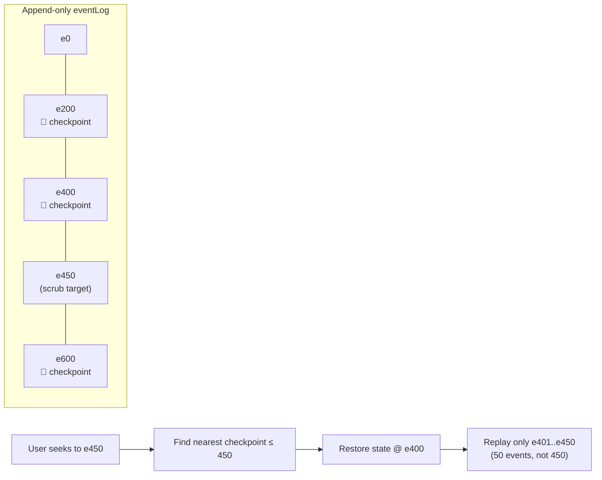

# Deep Dive: Resilience & Observability

## Resilience: surviving a network that doesn't cooperate

A crawler's dominant source of uncertainty is the network: response times ranging from milliseconds to multi-second stalls, servers that don't respond at all, and rate-limit blocks (`429 Too Many Requests`) from sites that don't want to be hit at whatever pace the crawler defaults to. CrawlViz's answer, implemented in `pipelines/requests_pipeline.py` and `pipelines/retry_processor.py`, has three parts working together rather than one:

**Rate limiting is a hard floor, not a target.** `RequestsPipeline` enforces a fixed minimum delay between requests *per worker* (the report's reference run used 1 req/s across 2 workers). This is enforced before a request is even attempted, not reactively after a `429`.

**Exponential backoff is shared per pipeline, not per request.** `self.backoff_delay` lives on the `RequestsPipeline` instance, not on individual requests — every worker in that pipeline observes and updates the same backoff state. On a transient failure or a `429`, the delay doubles (capped at a configured maximum); on success, it decays back down gradually rather than resetting instantly, so a pipeline that just recovered from rate-limiting doesn't immediately slam the target again at full speed.

**Jitter desynchronizes concurrent workers.** A small random delay (`random.uniform(0, 0.2)` seconds) is added on top of the computed backoff for each worker independently. Without this, multiple workers hitting backoff at the same moment would retry in lockstep — the exact thundering-herd pattern the report names explicitly (§1.5) as the thing jitter exists to prevent.

**A separate `RetryProcessor` handles content-level failures**, not just network-level ones: it subscribes to `RequestFailedEvent` and `EmptyScoreResultsEvent` (an LLM call that came back with nothing usable) and re-queues the affected node back through `RequestsPipeline`, decoupled from the low-level backoff/jitter logic living in the pipeline itself. This is a second retry mechanism at a different layer — network resilience and pipeline-level recovery are handled by different components with different concerns, not one catch-all retry wrapper.

## Deduplication: what "filtered" actually means

`FilteringPipeline` maintains two separate hash-based dedup sets in `Storage` — one for links (by normalized URL), one for extracted items (by a content hash of the item's fields, not just its source URL, so the same content reached via two different URLs is still recognized as a duplicate). This is worth being precise about because the report explicitly warns against the natural misreading (§1.7.2): a node reaching the `FILTERED` state does not mean the node was rejected. It means the *links and items found on that node's page* went through deduplication — the node itself is unaffected either way. In the report's own worked example (a node inspector panel showing 201 accepted links and 70 filtered out of a page), "filtered" is describing what happened to that page's outgoing links, not a judgment on the page itself.

## Observability: two tiers, one event stream

Both `LoggingPipeline` and `DebuggingPipeline` are ordinary broker subscribers — they don't intercept anything before it reaches other pipelines, and disabling `DebuggingPipeline` changes nothing about crawl behavior, only about how much of it gets recorded. `LoggingPipeline` is always active and renders the fixed node-lifecycle transitions (`CREATED → FETCHED → FILTERED → TRANSFORMED → SCORED → EXPANDED`) as structured entries carrying node ID, worker ID, and state. `DebuggingPipeline` is optional and subscribes far more broadly — NLP score breakdowns, full LLM request/response cycles including prompt size and parsed result counts, and network-level send/receive events — the report's worked examples (§3.2.8) of NLP scores by page type and LLM prompt-to-response traces are exactly this tier's output.

## Traceability: causal, not just chronological

`traceability/emitter.py` and `traceability/trace_context.py` implement something distinct from ordinary logging: every significant event carries a `correlation_id` threaded through the pipelines that touch it, so a single node's entire journey — fetch, extraction, filtering, scoring, priority — can be reconstructed as one causal chain after the fact, not just as a set of timestamp-ordered log lines that happen to mention the same node ID. `TRACE_MODE` and `TRACE_SAMPLE_RATE` (backend env vars, `full` / `0.1` by default per the README) control how much of this is captured, trading completeness against overhead.

This is what makes the report's "replayability" claim (§1.7.1) more than an assertion: the formal framing — that graph state at time *t* is a deterministic projection of the ordered event prefix up to *t*, reconstructed from an empty initial state — is exactly what the frontend implements, not just what the backend logs.

*An actual `DebuggingPipeline` trace: LLM prompt construction, dispatch, network round-trip, and parsed response for one node's topic-expansion call, each line carrying the correlation ID that ties it back to a specific node.*

## Replay: an event-sourced frontend, with checkpoints

The React frontend does not maintain crawl state as a value that gets mutated as WebSocket messages arrive. It maintains an **append-only event log** (`state.eventLog`) and derives all rendered state by feeding that log through a pure reducer (`crawler-ui/src/state/reducer.js`, `applyEvent()`). This is the same principle the report's §1.7.1 describes for the backend's causal log, implemented independently on the frontend for the UI's own replay feature.

The naive version of this — replay the *entire* log from scratch every time the user scrubs the timeline — is what the codebase calls out as the V1 approach and explicitly moved away from, because it degrades as the event log grows (scrubbing near the end of a long crawl means replaying thousands of events on every drag of the slider). The current reducer instead **checkpoints a full state snapshot every `SNAPSHOT_INTERVAL` (200) events**, and `replayTo(index)` finds the nearest checkpoint at or before the target index and replays only the remainder:

This works safely *because* the reducer follows strict immutable-update discipline everywhere (`{...state}`, `new Map(state.nodes)`, never mutating in place) — a stored checkpoint is a plain object reference, and it's safe to hold onto precisely because nothing already-referenced can be mutated out from under it later. The checkpointing optimization and the immutability discipline it depends on are the same design decision, not two unrelated facts about the code.

The backend's `SNAPSHOT_FULL` message and the frontend's own checkpoints solve *related but distinct* problems: `SNAPSHOT_FULL` lets a browser that connects mid-crawl catch up without replaying the crawl's entire history over the wire; the frontend's internal checkpoints let an *already-connected* browser scrub backward through what it's already received without replaying its own local log from the start every time. Both exist because "rebuild state as a projection of an event sequence" is expensive to do naively at any scale, and both were added specifically once that cost became visible (this is one of the concrete before/after improvements documented in the project's own `docs/V2_ARCHITECTURE.md`).

## What the UI bridge deliberately does not do

`TelemetryBridge` and `UIWebSocketGateway`'s docstrings are unusually explicit about their own boundaries, and it's worth stating those boundaries directly because they explain why the observability layer doesn't introduce feedback loops or hidden coupling: `TelemetryBridge` never emits events back into the `EventBroker`, never calls another pipeline, and its handler methods are synchronous by design (only the entry point and the final broadcast call are `async`, the minimum required). `UIWebSocketGateway` has no business logic — its job is accepting connections, sending the catch-up snapshot, and broadcasting, nothing else. This means the entire observability path is a one-way tap on the crawl's event stream: watching it, replaying it, or disconnecting from it cannot change what the crawl itself does.
